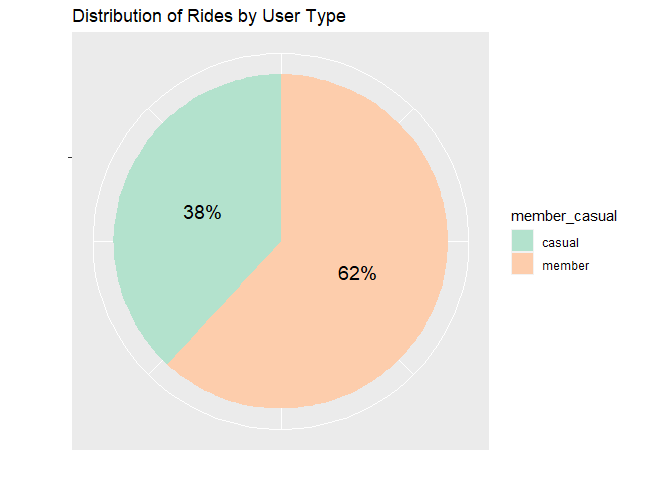
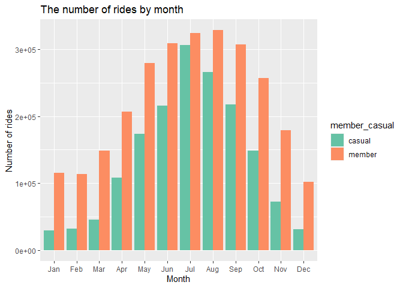
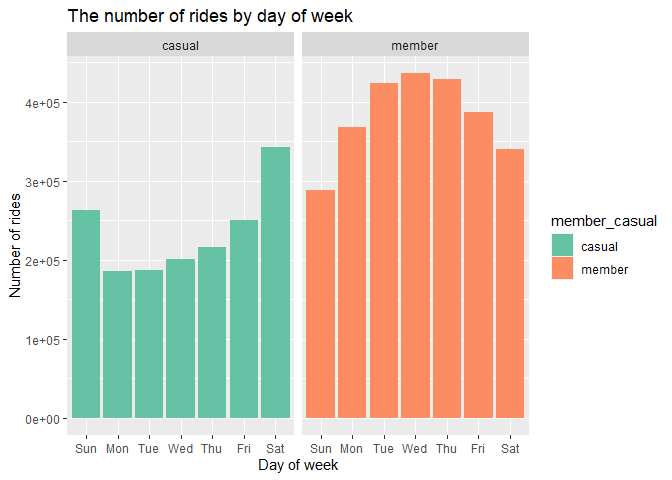
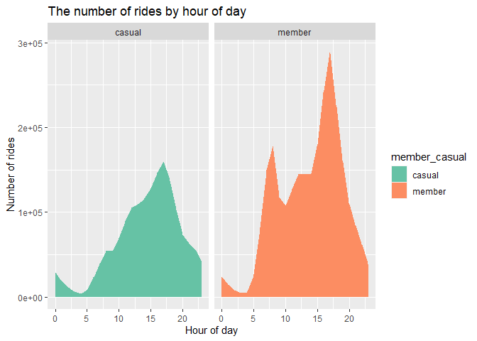
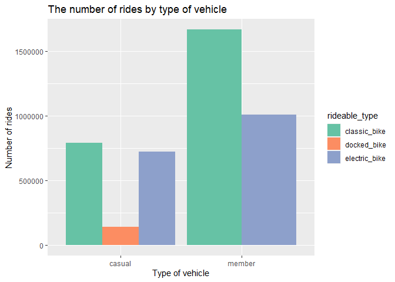
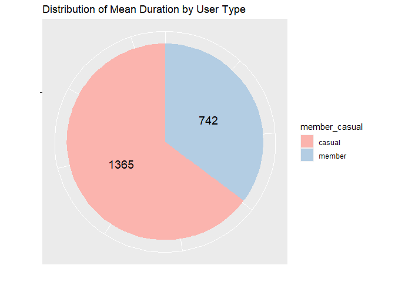
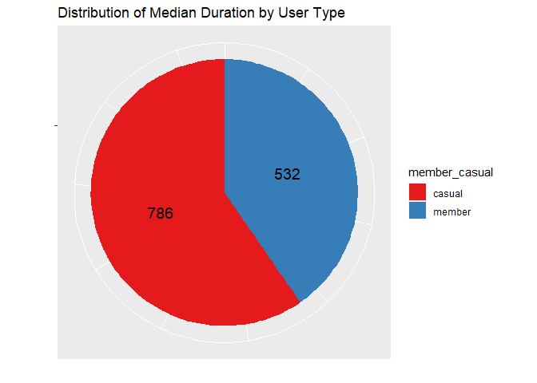
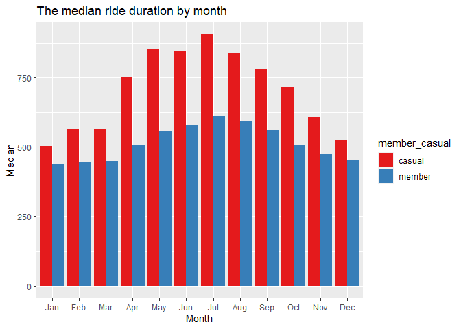
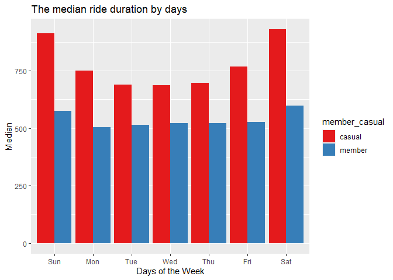
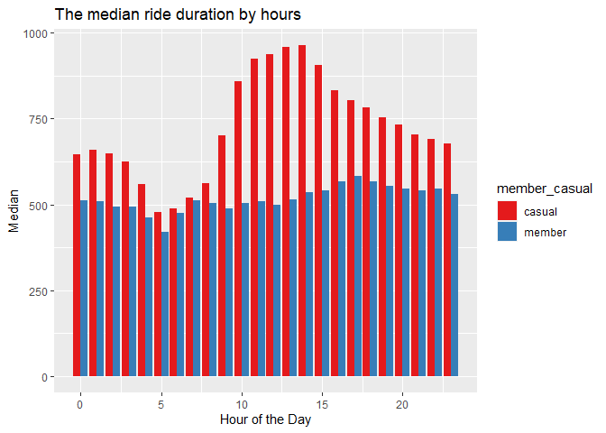

# Cyclistic: How Does a Bike-Share Navigate Speedy Success?


## Table of Content

-   [Ask](#1-ask)
-   [Prepare](#2-prepare)
-   [Process](#3-process)
-   [Analyze](#4-analyze)
-   [Share](#5-share)
-   [Act](#6-act)

### 1. Ask

**Business task**

Analyze and understand how casual riders and annual members use
Cyclistic bikes differently in order to design a new marketing strategy
to convert casual riders into annual members

**Stakeholders**

-   The director of marketing of Cyclistic *Lily Moreno*
-   Cyclistic marketing analytics team
-   Cyclistic executive team

### 2. Prepare

**Data source**

Cyclistic’s historical trip data: last 12 months from July 2022 to June
2023 link to data source:
<https://divvy-tripdata.s3.amazonaws.com/index.html>

**Data organize**

Monthly csv-files contains metadata for Bike Trips Metadata for Trips:

*Variables*:

-   ride_id: ID attached to each trip taken
-   rideable_type: type of vehicle (classic bike/electric bike/docked
    bike)
-   started_at: day and time trip started, in CST
-   ended_at: day and time trip ended, in CST
-   start_station_name: name of station where trip originated
-   end_station_name: name of station where trip terminated
-   start_station_id: ID of station where trip originated
-   end_station_id: ID of station where trip terminated
-   start_lat: latitude of station where trip originated coordinates
-   start_lng: longitude of station where trip originated coordinates
-   end_lat: latitude of station where trip terminated coordinates
-   end_lng: longitude of station where trip terminated coordinates
-   member_casual: “casual” is a rider who purchased a 24-Hour Pass;
    “member” is a rider who purchased an Annual Membership

*Notes*:

-   First row contains column names
-   202207-divvy-tripdata.csv has 823,488 rows
-   202208-divvy-tripdata.csv has 785,932 rows
-   202209-divvy-publictripdata.csv has 701,339 rows
-   202210-divvy-tripdata.csv has 558,685 rows
-   202211-divvy-tripdata.csv has 337,735 rows
-   202212-divvy-tripdata.csv has 181,806 rows
-   202301-divvy-tripdata.csv has 190,301 rows
-   202302-divvy-tripdata.csv has 190,445 rows
-   202303-divvy-tripdata.csv has 258,678 rows
-   202304-divvy-tripdata.csv has 426,590 rows
-   202305-divvy-tripdata.csv has 604,827 rows
-   202306-divvy-tripdata.csv has 719,618 rows

**Bias and credibility in data**

The data is reliable, original, comprehensive, current and cited

**Licensing**

The data has been made available by Motivate International Inc.  under
this [license](https://ride.divvybikes.com/data-license-agreement)

**Load packages**

Set of packages for data tidying, manipulation and visualization:

``` r
library(tidyverse)
```

    ## ── Attaching core tidyverse packages ──────────────────────── tidyverse 2.0.0 ──
    ## ✔ dplyr     1.1.2     ✔ readr     2.1.4
    ## ✔ forcats   1.0.0     ✔ stringr   1.5.0
    ## ✔ ggplot2   3.4.2     ✔ tibble    3.2.1
    ## ✔ lubridate 1.9.2     ✔ tidyr     1.3.0
    ## ✔ purrr     1.0.1     
    ## ── Conflicts ────────────────────────────────────────── tidyverse_conflicts() ──
    ## ✖ dplyr::filter() masks stats::filter()
    ## ✖ dplyr::lag()    masks stats::lag()
    ## ℹ Use the conflicted package (<http://conflicted.r-lib.org/>) to force all conflicts to become errors

for dates and times functions:

``` r
library(lubridate)
```

for summaries of data:

``` r
library(skimr)
```

and for scale function for visualization:

``` r
library(scales)
```

    ## 
    ## Attaching package: 'scales'

    ## The following object is masked from 'package:purrr':
    ## 
    ##     discard

    ## The following object is masked from 'package:readr':
    ## 
    ##     col_factor

**Collect data**

Import csv-files into temporary data-frames:

``` r
setwd("C:/Users/Haidamac/Documents")
td202207 <- read.csv("202207-divvy-tripdata.csv")
td202208 <- read.csv("202208-divvy-tripdata.csv")
td202209 <- read.csv("202209-divvy-publictripdata.csv")
td202210 <- read.csv("202210-divvy-tripdata.csv")
td202211 <- read.csv("202211-divvy-tripdata.csv")
td202212 <- read.csv("202212-divvy-tripdata.csv")
td202301 <- read.csv("202301-divvy-tripdata.csv")
td202302 <- read.csv("202302-divvy-tripdata.csv")
td202303 <- read.csv("202303-divvy-tripdata.csv")
td202304 <- read.csv("202304-divvy-tripdata.csv")
td202305 <- read.csv("202305-divvy-tripdata.csv")
td202306 <- read.csv("202306-divvy-tripdata.csv")
```

Merge monthly temporary data-frames in single data-frame:

``` r
trip_data <- rbind(td202207,td202208,td202209,td202210,td202211,td202212,
                   td202301,td202302,td202303,td202304,td202305,td202306)
```

Check structure of data frame:

``` r
str(trip_data)
```

    ## 'data.frame':    5779444 obs. of  13 variables:
    ##  $ ride_id           : chr  "954144C2F67B1932" "292E027607D218B6" "57765852588AD6E0" "B5B6BE44314590E6" ...
    ##  $ rideable_type     : chr  "classic_bike" "classic_bike" "classic_bike" "classic_bike" ...
    ##  $ started_at        : chr  "2022-07-05 08:12:47" "2022-07-26 12:53:38" "2022-07-03 13:58:49" "2022-07-31 17:44:21" ...
    ##  $ ended_at          : chr  "2022-07-05 08:24:32" "2022-07-26 12:55:31" "2022-07-03 14:06:32" "2022-07-31 18:42:50" ...
    ##  $ start_station_name: chr  "Ashland Ave & Blackhawk St" "Buckingham Fountain (Temp)" "Buckingham Fountain (Temp)" "Buckingham Fountain (Temp)" ...
    ##  $ start_station_id  : chr  "13224" "15541" "15541" "15541" ...
    ##  $ end_station_name  : chr  "Kingsbury St & Kinzie St" "Michigan Ave & 8th St" "Michigan Ave & 8th St" "Woodlawn Ave & 55th St" ...
    ##  $ end_station_id    : chr  "KA1503000043" "623" "623" "TA1307000164" ...
    ##  $ start_lat         : num  41.9 41.9 41.9 41.9 41.9 ...
    ##  $ start_lng         : num  -87.7 -87.6 -87.6 -87.6 -87.6 ...
    ##  $ end_lat           : num  41.9 41.9 41.9 41.8 41.9 ...
    ##  $ end_lng           : num  -87.6 -87.6 -87.6 -87.6 -87.7 ...
    ##  $ member_casual     : chr  "member" "casual" "casual" "casual" ...

Data frame contains 5773649 observations of 13 variables

Check names of variable:

``` r
colnames(trip_data)
```

    ##  [1] "ride_id"            "rideable_type"      "started_at"        
    ##  [4] "ended_at"           "start_station_name" "start_station_id"  
    ##  [7] "end_station_name"   "end_station_id"     "start_lat"         
    ## [10] "start_lng"          "end_lat"            "end_lng"           
    ## [13] "member_casual"

Data frame contains 13 variables according to metadata description

Check 6 first records of data frame:

``` r
head(trip_data)
```

    ##            ride_id rideable_type          started_at            ended_at
    ## 1 954144C2F67B1932  classic_bike 2022-07-05 08:12:47 2022-07-05 08:24:32
    ## 2 292E027607D218B6  classic_bike 2022-07-26 12:53:38 2022-07-26 12:55:31
    ## 3 57765852588AD6E0  classic_bike 2022-07-03 13:58:49 2022-07-03 14:06:32
    ## 4 B5B6BE44314590E6  classic_bike 2022-07-31 17:44:21 2022-07-31 18:42:50
    ## 5 A4C331F2A00E79E0  classic_bike 2022-07-13 19:49:06 2022-07-13 20:15:24
    ## 6 579D73BE2ED880B3 electric_bike 2022-07-01 17:04:35 2022-07-01 17:13:18
    ##            start_station_name start_station_id               end_station_name
    ## 1  Ashland Ave & Blackhawk St            13224       Kingsbury St & Kinzie St
    ## 2  Buckingham Fountain (Temp)            15541          Michigan Ave & 8th St
    ## 3  Buckingham Fountain (Temp)            15541          Michigan Ave & 8th St
    ## 4  Buckingham Fountain (Temp)            15541         Woodlawn Ave & 55th St
    ## 5      Wabash Ave & Grand Ave     TA1307000117 Sheffield Ave & Wellington Ave
    ## 6 Desplaines St & Randolph St            15535      Clinton St & Roosevelt Rd
    ##   end_station_id start_lat start_lng  end_lat   end_lng member_casual
    ## 1   KA1503000043  41.90707 -87.66725 41.88918 -87.63851        member
    ## 2            623  41.86962 -87.62398 41.87277 -87.62398        casual
    ## 3            623  41.86962 -87.62398 41.87277 -87.62398        casual
    ## 4   TA1307000164  41.86962 -87.62398 41.79526 -87.59647        casual
    ## 5   TA1307000052  41.89147 -87.62676 41.93625 -87.65266        member
    ## 6         WL-008  41.88461 -87.64456 41.86712 -87.64109        member

Therefore, the composition of the data and the sample are sufficient to
achieve the goal of the analysis

### 3. Process

**Tools for analysis**

R (RStudio) with tinyverse packages and Tableau are used

**Clean data**

Key tasks:

-   Duplicate records in data frame should be excluded
-   Rides with n/a data and missing data should be excluded
-   Rides that did not include a start or end station should be excluded

Check number of rows before cleaning:

``` r
rows_before <- nrow(trip_data)
```

Check data frame for N/A records:

``` r
na_records <- is.na(trip_data)
na_count_per_column <- colSums(na_records)
total_na_count <- sum(na_records)
```

Data frame contains 11590 N/A records

Drop N/A:

``` r
trip_data <- drop_na(trip_data)
```

Check for duplicate ride_ids:

``` r
anyDuplicated(trip_data$ride_id)
```

    ## [1] 0

Data frame contains no duplicate records

Clean all missing values:

``` r
trip_data <- trip_data[!(trip_data$start_station_name == "" |
                           trip_data$start_station_id == "" |
                           trip_data$end_station_name == "" |
                           trip_data$end_station_id == "" ),]
```

Check number of row after cleaning:

``` r
rows_after <- nrow(trip_data)
```

Number of removed rows during cleaning:

``` r
print(paste("Removed", rows_before - rows_after, " rows during cleaning"))
```

    ## [1] "Removed 1370355  rows during cleaning"

So, removed 1364560 rows, but the remaining sample of 4,409,089
observations is sufficient for the analysis

**Transform data**

Key tasks:

-   Check data for the correct datatype
-   Add and calculate necessary columns for further analysis
-   Rides less than 1 minute in duration should be excluded
-   Rides greater than 24 hours in duration should be excluded

Check of properly data format:

``` r
summary(trip_data)
```

    ##    ride_id          rideable_type       started_at          ended_at        
    ##  Length:4409089     Length:4409089     Length:4409089     Length:4409089    
    ##  Class :character   Class :character   Class :character   Class :character  
    ##  Mode  :character   Mode  :character   Mode  :character   Mode  :character  
    ##                                                                             
    ##                                                                             
    ##                                                                             
    ##  start_station_name start_station_id   end_station_name   end_station_id    
    ##  Length:4409089     Length:4409089     Length:4409089     Length:4409089    
    ##  Class :character   Class :character   Class :character   Class :character  
    ##  Mode  :character   Mode  :character   Mode  :character   Mode  :character  
    ##                                                                             
    ##                                                                             
    ##                                                                             
    ##    start_lat       start_lng         end_lat         end_lng      
    ##  Min.   :41.65   Min.   :-87.84   Min.   : 0.00   Min.   :-87.84  
    ##  1st Qu.:41.88   1st Qu.:-87.66   1st Qu.:41.88   1st Qu.:-87.66  
    ##  Median :41.90   Median :-87.64   Median :41.90   Median :-87.64  
    ##  Mean   :41.90   Mean   :-87.65   Mean   :41.90   Mean   :-87.65  
    ##  3rd Qu.:41.93   3rd Qu.:-87.63   3rd Qu.:41.93   3rd Qu.:-87.63  
    ##  Max.   :42.06   Max.   :-87.53   Max.   :42.06   Max.   :  0.00  
    ##  member_casual     
    ##  Length:4409089    
    ##  Class :character  
    ##  Mode  :character  
    ##                    
    ##                    
    ## 

Variables *started_at* and *ended_at* have *character* but need
*datetime*

Convert this columns in datetime format:

``` r
trip_data$started_at <- ymd_hms(trip_data$started_at)
trip_data$ended_at <- ymd_hms(trip_data$ended_at)
```

Check of properly data format again:

``` r
skim(trip_data)
```

|                                                  |           |
|:-------------------------------------------------|:----------|
| Name                                             | trip_data |
| Number of rows                                   | 4409089   |
| Number of columns                                | 13        |
| \_\_\_\_\_\_\_\_\_\_\_\_\_\_\_\_\_\_\_\_\_\_\_   |           |
| Column type frequency:                           |           |
| character                                        | 7         |
| numeric                                          | 4         |
| POSIXct                                          | 2         |
| \_\_\_\_\_\_\_\_\_\_\_\_\_\_\_\_\_\_\_\_\_\_\_\_ |           |
| Group variables                                  | None      |

Data summary

**Variable type: character**

| skim_variable      | n_missing | complete_rate | min | max | empty | n_unique | whitespace |
|:----------------|---------:|------------:|----:|----:|-----:|--------:|---------:|
| ride_id            |         0 |             1 |  16 |  16 |     0 |  4409089 |          0 |
| rideable_type      |         0 |             1 |  11 |  13 |     0 |        3 |          0 |
| start_station_name |         0 |             1 |   3 |  64 |     0 |     1702 |          0 |
| start_station_id   |         0 |             1 |   3 |  35 |     0 |     1449 |          0 |
| end_station_name   |         0 |             1 |   3 |  64 |     0 |     1722 |          0 |
| end_station_id     |         0 |             1 |   3 |  36 |     0 |     1454 |          0 |
| member_casual      |         0 |             1 |   6 |   6 |     0 |        2 |          0 |

**Variable type: numeric**

| skim_variable | n_missing | complete_rate |   mean |   sd |     p0 |    p25 |    p50 |    p75 |   p100 | hist  |
|:----------|-------:|----------:|-----:|----:|-----:|-----:|-----:|-----:|-----:|:----|
| start_lat     |         0 |             1 |  41.90 | 0.04 |  41.65 |  41.88 |  41.90 |  41.93 |  42.06 | ▁▁▇▇▁ |
| start_lng     |         0 |             1 | -87.65 | 0.03 | -87.84 | -87.66 | -87.64 | -87.63 | -87.53 | ▁▁▃▇▁ |
| end_lat       |         0 |             1 |  41.90 | 0.08 |   0.00 |  41.88 |  41.90 |  41.93 |  42.06 | ▁▁▁▁▇ |
| end_lng       |         0 |             1 | -87.65 | 0.13 | -87.84 | -87.66 | -87.64 | -87.63 |   0.00 | ▇▁▁▁▁ |

**Variable type: POSIXct**

| skim_variable | n_missing | complete_rate | min                 | max                 | median              | n_unique |
|:---------|------:|---------:|:------------|:------------|:------------|------:|
| started_at    |         0 |             1 | 2022-07-01 00:00:01 | 2023-06-30 23:59:45 | 2022-11-01 15:50:55 |  3844004 |
| ended_at      |         0 |             1 | 2022-07-01 00:06:23 | 2023-07-01 18:26:01 | 2022-11-01 16:05:21 |  3856287 |

Add *duration* column (duration of each ride in seconds) for further
analysis:

``` r
trip_data$duration <- as.numeric(trip_data$ended_at - trip_data$started_at, units = "secs")
```

Add *month* column

``` r
trip_data$month <- month(trip_data$started_at, label = TRUE, locale = "en")
```

Add *weekday* column

``` r
trip_data$weekday <- wday(trip_data$started_at, label = TRUE, locale = "en")
```

Add *dayhour* column

``` r
trip_data$dayhour <- hour(trip_data$started_at)
```

And check new column for errors:

``` r
skim(trip_data)
```

|                                                  |           |
|:-------------------------------------------------|:----------|
| Name                                             | trip_data |
| Number of rows                                   | 4409089   |
| Number of columns                                | 17        |
| \_\_\_\_\_\_\_\_\_\_\_\_\_\_\_\_\_\_\_\_\_\_\_   |           |
| Column type frequency:                           |           |
| character                                        | 7         |
| factor                                           | 2         |
| numeric                                          | 6         |
| POSIXct                                          | 2         |
| \_\_\_\_\_\_\_\_\_\_\_\_\_\_\_\_\_\_\_\_\_\_\_\_ |           |
| Group variables                                  | None      |

Data summary

**Variable type: character**

| skim_variable      | n_missing | complete_rate | min | max | empty | n_unique | whitespace |
|:----------------|---------:|------------:|----:|----:|-----:|--------:|---------:|
| ride_id            |         0 |             1 |  16 |  16 |     0 |  4409089 |          0 |
| rideable_type      |         0 |             1 |  11 |  13 |     0 |        3 |          0 |
| start_station_name |         0 |             1 |   3 |  64 |     0 |     1702 |          0 |
| start_station_id   |         0 |             1 |   3 |  35 |     0 |     1449 |          0 |
| end_station_name   |         0 |             1 |   3 |  64 |     0 |     1722 |          0 |
| end_station_id     |         0 |             1 |   3 |  36 |     0 |     1454 |          0 |
| member_casual      |         0 |             1 |   6 |   6 |     0 |        2 |          0 |

**Variable type: factor**

| skim_variable | n_missing | complete_rate | ordered | n_unique | top_counts                                         |
|:---------|-------:|---------:|:-----|------:|:--------------------------------|
| month         |         0 |             1 | TRUE    |       12 | Jul: 642680, Aug: 605325, Sep: 535145, Jun: 534758 |
| weekday       |         0 |             1 | TRUE    |        7 | Sat: 697878, Thu: 658436, Wed: 651094, Fri: 650370 |

**Variable type: numeric**

| skim_variable | n_missing | complete_rate |   mean |      sd |        p0 |    p25 |    p50 |     p75 |       p100 | hist  |
|:---------|------:|---------:|-----:|-----:|------:|-----:|-----:|-----:|-------:|:----|
| start_lat     |         0 |             1 |  41.90 |    0.04 |     41.65 |  41.88 |  41.90 |   41.93 |      42.06 | ▁▁▇▇▁ |
| start_lng     |         0 |             1 | -87.65 |    0.03 |    -87.84 | -87.66 | -87.64 |  -87.63 |     -87.53 | ▁▁▃▇▁ |
| end_lat       |         0 |             1 |  41.90 |    0.08 |      0.00 |  41.88 |  41.90 |   41.93 |      42.06 | ▁▁▁▁▇ |
| end_lng       |         0 |             1 | -87.65 |    0.13 |    -87.84 | -87.66 | -87.64 |  -87.63 |       0.00 | ▇▁▁▁▁ |
| duration      |         0 |             1 | 963.08 | 2218.59 | -10122.00 | 343.00 | 600.00 | 1071.00 | 1922127.00 | ▇▁▁▁▁ |
| dayhour       |         0 |             1 |  14.13 |    4.93 |      0.00 |  11.00 |  15.00 |   18.00 |      23.00 | ▁▃▅▇▃ |

**Variable type: POSIXct**

| skim_variable | n_missing | complete_rate | min                 | max                 | median              | n_unique |
|:---------|------:|---------:|:------------|:------------|:------------|------:|
| started_at    |         0 |             1 | 2022-07-01 00:00:01 | 2023-06-30 23:59:45 | 2022-11-01 15:50:55 |  3844004 |
| ended_at      |         0 |             1 | 2022-07-01 00:06:23 | 2023-07-01 18:26:01 | 2022-11-01 16:05:21 |  3856287 |

We got some records with negative duration Create subset with records of
negative duration only:

``` r
negative_duration <- trip_data %>% 
  filter(duration < 0)
```

Check dimension of subset:

``` r
dim(negative_duration)
```

    ## [1] 76 17

We have 76 records with negative duration Preview of subset:

``` r
head(negative_duration)
```

    ##            ride_id rideable_type          started_at            ended_at
    ## 1 029D853B5C38426E  classic_bike 2022-07-26 20:07:33 2022-07-26 19:59:34
    ## 2 C1D6D749139CB6C0  classic_bike 2022-07-26 20:08:04 2022-07-26 19:59:34
    ## 3 D3E7C0B68EFEC32B  classic_bike 2022-07-26 20:20:31 2022-07-26 19:59:34
    ## 4 48EA91B86A4220BD  classic_bike 2022-07-26 18:35:57 2022-07-26 18:32:30
    ## 5 035C91D5B31A0E17 electric_bike 2022-07-30 09:36:02 2022-07-30 09:35:53
    ## 6 461CC55C9B00468B electric_bike 2022-07-09 20:31:40 2022-07-09 20:30:17
    ##            start_station_name start_station_id            end_station_name
    ## 1    Lincoln Ave & Roscoe St*     chargingstx5    Lincoln Ave & Roscoe St*
    ## 2    Lincoln Ave & Roscoe St*     chargingstx5    Lincoln Ave & Roscoe St*
    ## 3    Lincoln Ave & Roscoe St*     chargingstx5    Lincoln Ave & Roscoe St*
    ## 4    Lincoln Ave & Roscoe St*     chargingstx5    Lincoln Ave & Roscoe St*
    ## 5 Southport Ave & Belmont Ave            13229 Southport Ave & Belmont Ave
    ## 6    Leavitt St & Chicago Ave            18058    Leavitt St & Chicago Ave
    ##   end_station_id start_lat start_lng  end_lat   end_lng member_casual duration
    ## 1   chargingstx5  41.94335 -87.67067 41.94335 -87.67067        member     -479
    ## 2   chargingstx5  41.94335 -87.67067 41.94335 -87.67067        member     -510
    ## 3   chargingstx5  41.94335 -87.67067 41.94335 -87.67067        casual    -1257
    ## 4   chargingstx5  41.94335 -87.67067 41.94335 -87.67067        casual     -207
    ## 5          13229  41.93945 -87.66377 41.93948 -87.66375        member       -9
    ## 6          18058  41.89550 -87.68202 41.89550 -87.68202        member      -83
    ##   month weekday dayhour
    ## 1   Jul     Tue      20
    ## 2   Jul     Tue      20
    ## 3   Jul     Tue      20
    ## 4   Jul     Tue      18
    ## 5   Jul     Sat       9
    ## 6   Jul     Sat      20

6 first records with negative duration have same start and end station
name. So, we assume the trip just didn’t happen

Same procedure for zero duration:

``` r
zero_duration <- trip_data %>% 
  filter(duration == 0)
dim(zero_duration)
```

    ## [1] 263  17

We have 263 records with duration in 0 second, therefor trips just
didn’t happen too

We also need to search for trips lasting less than one minute, because
this most likely indicates technical malfunctions during the bike rental
and the refusal of further trips:

``` r
short_duration <- trip_data %>% 
  filter(duration < 60)
dim(short_duration)
```

    ## [1] 90992    17

There are 90653 observations with ride duration less than 1 minute.

We also need to search for rides greater than 24 hours, because it
probably indicates test rides

``` r
long_duration <- trip_data %>% 
  filter(duration > 86400)
dim(long_duration)
```

    ## [1] 105  17

There are 105 rides with long duration

We need to clean our data from this records (negative, zero and short
duration):

``` r
trip_data <- trip_data[!(trip_data$duration < 60 | trip_data$duration > 86400),]
```

Data is ready for analysis

### 4. Analyze

Key tasks: \* Aggregate data for rides distributions \* Identify trends
and relationships

**Distribution of rides by user types**

``` r
rd_usertype <- trip_data %>% 
  group_by(member_casual) %>% 
  summarize(count = length(member_casual), part_rides = (length(member_casual) / nrow(trip_data)) * 100 )

print(rd_usertype)
```

    ## # A tibble: 2 × 3
    ##   member_casual   count part_rides
    ##   <chr>           <int>      <dbl>
    ## 1 casual        1646643       38.1
    ## 2 member        2671349       61.9

So, we can see 61.9% all rides are made by members who purchased an
Annual Membership and a little more than a third (38.1%) - by other
users ([figure 1](#figure1))

**Distribution of rides by user types and month**

``` r
rd_month <- trip_data %>% 
  group_by(member_casual, month) %>%
  summarise(count = length(month),
            .groups = "drop")
```

Calculation mean and standard deviation of monthly rides for casual and
member users separately: \* for casual users:

``` r
casual_rd_month <- trip_data %>% 
  group_by(month) %>%
  filter(member_casual == "casual") %>% 
  summarise(count = length(month), .groups = "drop")
casual_rd_month %>% 
  summarise(mean(count),sd(count))
```

    ## # A tibble: 1 × 2
    ##   `mean(count)` `sd(count)`
    ##           <dbl>       <dbl>
    ## 1       137220.      98516.

-   for members:

``` r
member_rd_month <- trip_data %>% 
  group_by(month) %>%
  filter(member_casual == "member") %>% 
  summarise(count = length(month), .groups = "drop")
member_rd_month %>% 
  summarise(mean(count),sd(count))
```

    ## # A tibble: 1 × 2
    ##   `mean(count)` `sd(count)`
    ##           <dbl>       <dbl>
    ## 1       222612.      88568.

Therefore, the standard deviation for casual users (98516) is higher
than the standard deviation for members (88568). Thus, seasonality is
more pronounced for casual users. Demand is much lower in the winter
months than in the summer. This is natural for bike trips. But for
casual users this seasonality is more pronounced than for members
([figure 2](#figure2))

**Distribution of rides by user types and day of the week**

``` r
rd_weekday <- trip_data %>% 
  group_by(member_casual, weekday) %>%
  summarise(count = length(weekday),
            .groups = "drop")
```

Calculation mean and standard deviation of daily rides for casual and
member users separately: \* for casual users:

``` r
casual_rd_weekday <- trip_data %>% 
  group_by(weekday) %>%
  filter(member_casual == "casual") %>% 
  summarise(count = length(weekday), .groups = "drop")
casual_rd_weekday %>% 
  summarise(mean(count),sd(count))
```

    ## # A tibble: 1 × 2
    ##   `mean(count)` `sd(count)`
    ##           <dbl>       <dbl>
    ## 1       235235.      56145.

-   for members:

``` r
member_rd_weekday <- trip_data %>% 
  group_by(weekday) %>%
  filter(member_casual == "member") %>% 
  summarise(count = length(weekday), .groups = "drop")
member_rd_weekday %>% 
  summarise(mean(count),sd(count))
```

    ## # A tibble: 1 × 2
    ##   `mean(count)` `sd(count)`
    ##           <dbl>       <dbl>
    ## 1       381621.      54021.

Therefore, the standard deviation for casual users (56145) is somewhat
higher than the standard deviation for members (54021). Demand is
significantly higher in weekends for casual users. Thus, we can assume
that they mainly use bicycle rental for recreation. Members, on the
other hand, mostly use bike rental on weekdays, so we assume they use
our service for commuting ([figure 3](#figure3))

**Distribution of rides by user types and hour of the day**

``` r
rd_dayhour <- trip_data %>% 
  group_by(member_casual, dayhour) %>%
  summarise(count = length(dayhour),
            .groups = "drop")
```

Calculation mean and standard deviation of hourly rides for casual and
member users separately: \* for casual users:

``` r
casual_rd_dayhour <- trip_data %>% 
  group_by(dayhour) %>%
  filter(member_casual == "casual") %>% 
  summarise(count = length(dayhour), .groups = "drop")
casual_rd_dayhour %>% 
  summarise(mean(count),sd(count))
```

    ## # A tibble: 1 × 2
    ##   `mean(count)` `sd(count)`
    ##           <dbl>       <dbl>
    ## 1        68610.      47885.

-   for members:

``` r
member_rd_dayhour <- trip_data %>% 
  group_by(dayhour) %>%
  filter(member_casual == "member") %>% 
  summarise(count = length(dayhour), .groups = "drop")
member_rd_dayhour %>% 
  summarise(mean(count),sd(count))
```

    ## # A tibble: 1 × 2
    ##   `mean(count)` `sd(count)`
    ##           <dbl>       <dbl>
    ## 1       111306.      79353.

Therefore, the standard deviation for casual users (47885) is more lower
than the standard deviation for members (79353). Members have a clear
preference for morning and evening bike rentals, supporting our
assumption that they use bike commuting to and from the work. Whereas
casual users use bike rental more evenly throughout the day ([figure
4](#figure4))

**Distribution of rides by user types and type of vehicle**

``` r
rd_rideable_type <- trip_data %>% 
  group_by(member_casual, rideable_type) %>%
  summarise(count = length(rideable_type),
            .groups = "drop")
print(rd_rideable_type)
```

    ## # A tibble: 5 × 3
    ##   member_casual rideable_type   count
    ##   <chr>         <chr>           <int>
    ## 1 casual        classic_bike   790045
    ## 2 casual        docked_bike    137444
    ## 3 casual        electric_bike  719154
    ## 4 member        classic_bike  1664022
    ## 5 member        electric_bike 1007327

Casual users prefer both classic and electric bikes equally but
sometimes choose docked bikes. Members prefer classic bikes, less -
electric ones ([figure 5](#figure5)).

**Distribution of rides by user types and start/end station**

``` r
rd_station <- trip_data %>% 
  group_by(member_casual, start_station_name) %>%
  summarise(count = length(start_station_name), start_id = first(start_station_id),
            .groups = "drop") %>% 
  arrange(desc(count))
print(rd_station)
```

    ## # A tibble: 3,010 × 4
    ##    member_casual start_station_name                 count start_id    
    ##    <chr>         <chr>                              <int> <chr>       
    ##  1 casual        Streeter Dr & Grand Ave            48932 13022       
    ##  2 casual        DuSable Lake Shore Dr & Monroe St  28592 13300       
    ##  3 member        Kingsbury St & Kinzie St           22997 KA1503000043
    ##  4 casual        Michigan Ave & Oak St              22058 13042       
    ##  5 casual        Millennium Park                    21571 13008       
    ##  6 member        Clark St & Elm St                  21190 TA1307000039
    ##  7 member        Clinton St & Washington Blvd       20428 WL-012      
    ##  8 casual        DuSable Lake Shore Dr & North Blvd 20033 LF-005      
    ##  9 member        Wells St & Concord Ln              19350 TA1308000050
    ## 10 member        Loomis St & Lexington St           19092 13332       
    ## # ℹ 3,000 more rows

Bike rental stations preferred by casual users and members are also not
equally distributed. While members rent bicycles in various parts of the
city (preferring the city center), casual users are mainly near lake
shore and other recreational areas ([figure 6](#figure6) and [figure
7](#figure7)). The most popular station for renting bicycles by casual
users is Streeter Dr & Grand Ave (49 thousand rent during the year). The
number of rentals is significantly lower at other popular rental
stations (f.e. 28 thousand on DuSable Lake Shore Dr & Monroe St).

**Distribution of rides by user types and duration of ride**

``` r
rd_duration <- trip_data %>% 
  group_by(member_casual) %>%
  summarise(mean = mean(duration), min = min(duration), max = max(duration), 
            sd = sd(duration), median = median(duration), .groups = "drop")
print(rd_duration)
```

    ## # A tibble: 2 × 6
    ##   member_casual  mean   min   max    sd median
    ##   <chr>         <dbl> <dbl> <dbl> <dbl>  <dbl>
    ## 1 casual        1365.    60 86362 2573.    786
    ## 2 member         742.    60 86180 1160.    532

The average trip duration of a casual user is almost twice that of a
member ([figure 8](#figure8)) However, if we exclude the extreme values
(median), this difference is no longer so significant ([figure
9](#figure9))

**Distribution of ride duration by user types and month**

``` r
duration_month <- trip_data %>% 
  group_by(member_casual, month) %>%
  summarise(mean = mean(duration), min = min(duration), max = max(duration), 
            sd = sd(duration), median = median(duration), .groups = "drop")
print(duration_month)
```

    ## # A tibble: 24 × 7
    ##    member_casual month  mean   min   max    sd median
    ##    <chr>         <ord> <dbl> <dbl> <dbl> <dbl>  <dbl>
    ##  1 casual        Jan    908.    60 81073 2694.    503
    ##  2 casual        Feb   1078.    60 85417 2926.    566
    ##  3 casual        Mar   1022.    60 85654 2702.    564
    ##  4 casual        Apr   1378.    60 85803 2980.    753
    ##  5 casual        May   1488.    60 86146 2866.    855
    ##  6 casual        Jun   1458.    60 86051 2934.    844
    ##  7 casual        Jul   1515.    60 86362 2459.    905
    ##  8 casual        Aug   1416.    60 86217 2361.    839
    ##  9 casual        Sep   1326.    60 83285 2334.    782
    ## 10 casual        Oct   1243.    60 86032 2278.    716
    ## # ℹ 14 more rows

The standard deviation of a casual user’s ride duration is almost double
that of a member. This is well illustrated by the chart of median trip
duration by month ([figure 10](#figure10)). The difference in trip
length for the casual user in the summer months is much greater than in
the winter, while the difference is less noticeable for members. This
supports our hypothesis that members mostly use bike rental for
commuting, while casual users for leisure, this explains the
seasonality.

**Distribution of ride duration by user types and day of the week**

``` r
duration_weekday <- trip_data %>% 
  group_by(member_casual, weekday) %>%
  summarise(mean = mean(duration), min = min(duration), max = max(duration), 
            sd = sd(duration), median = median(duration), .groups = "drop")
print(duration_weekday)
```

    ## # A tibble: 14 × 7
    ##    member_casual weekday  mean   min   max    sd median
    ##    <chr>         <ord>   <dbl> <dbl> <dbl> <dbl>  <dbl>
    ##  1 casual        Sun     1565.    60 86362 2813.    913
    ##  2 casual        Mon     1354.    60 85898 2593.    750
    ##  3 casual        Tue     1209.    60 86217 2343.    689
    ##  4 casual        Wed     1179.    60 86255 2344.    686
    ##  5 casual        Thu     1197.    60 86146 2386.    696
    ##  6 casual        Fri     1318.    60 86051 2558.    768
    ##  7 casual        Sat     1552.    60 86012 2716.    929
    ##  8 member        Sun      824.    60 85427 1274.    576
    ##  9 member        Mon      706.    60 85342 1142.    503
    ## 10 member        Tue      706.    60 86180 1162.    513
    ## 11 member        Wed      710.    60 85136 1047.    521
    ## 12 member        Thu      713.    60 86085 1028.    522
    ## 13 member        Fri      733.    60 85998 1163.    526
    ## 14 member        Sat      841.    60 82796 1342.    599

The same hypothesis is confirmed by the analysis of the median duration
of the ride by day of the week. For casual users it is significantly
higher on weekends than on weekdays, while for members the difference is
not as significant ([figure 11](#figure11)).

**Distribution of ride duration by user types and hour of the day**

``` r
duration_dayhour <- trip_data %>% 
  group_by(member_casual, dayhour) %>%
  summarise(mean = mean(duration), min = min(duration), max = max(duration), 
            sd = sd(duration), median = median(duration), .groups = "drop")
```

The duration of the members’ trip is virtually independent of the time
of day, while the dependence is significant for casual users: the
longest trips are in the middle of the day, while the shortest are in
the morning ([figure 12](#figure12))

### 5. Share

**Distribution of rides by user types**

``` r
pie <- ggplot(rd_usertype, aes(x='', y=part_rides, fill=member_casual))+
  geom_bar(width = 1, stat = "identity") + 
  coord_polar("y") +
  scale_fill_brewer(palette="Pastel2") + 
  theme(axis.text.x=element_blank()) +
  geom_text(aes(label = percent(part_rides / 100)),
            position = position_stack(vjust = 0.5), 
            size = 5) +
  labs(x= "", y= "", title = "Distribution of Rides by User Type")
```

### Figure 1



**Distribution of rides by user types and month**

``` r
rd_month_plot <- ggplot(rd_month, aes(month, count, fill = member_casual)) +
  geom_col(position = "dodge") +  scale_fill_brewer(palette="Set2") +
  labs(title = "The number of rides by month", x = "Month", y = "Number of rides")
```

### Figure 2



**Distribution of rides by user types and day of the week**

``` r
rd_weekday_plot <- ggplot(rd_weekday, aes(weekday, count, fill = member_casual)) +
  geom_col(position = "dodge") +  scale_fill_brewer(palette="Set2") +
  labs(title = "The number of rides by day of week", x="Day of week", y="Number of rides") +
  facet_wrap(~member_casual)
```

### Figure 3



**Distribution of rides by user types and hour of the day**

``` r
rd_dayhour_plot <- ggplot(rd_dayhour, aes(dayhour, count, fill = member_casual)) +
  geom_area() +  scale_fill_brewer(palette="Set2") +
  labs(title = "The number of rides by hour of day", x = "Hour of day", y = "Number of rides") +
  facet_wrap(~member_casual)
```

### Figure 4



**Distribution of rides by user types and type of vehicle**

``` r
rd_rideable_plot <- ggplot(rd_rideable_type, aes(member_casual, count, fill = rideable_type)) +
  geom_col(position = "dodge") +  scale_fill_brewer(palette="Set2") +
  labs(title = "The number of rides by type of vehicle", x = "Type of vehicle", y = "Number of rides")
```

### Figure 5



### Figure 6


*figure build with
[Tableau](https://public.tableau.com/app/profile/serge.krynytsia/viz/Cyclisticstartstationusage/Sheet1)*

### Figure 7


*figure build with
[Tableau](https://public.tableau.com/app/profile/serge.krynytsia/viz/Cyclisticendstationsusage/Sheet1)*

**Distribution of ride mean duration by user types**

``` r
mean_duration_plot <- ggplot(rd_duration, aes(x='', y=mean, fill=member_casual))+
  geom_bar(width = 1, stat = "identity") + 
  coord_polar("y") +
  scale_fill_brewer(palette="Pastel1") + 
  theme(axis.text.x=element_blank()) +
  geom_text(aes(label = round(mean, digits=0)),
            position = position_stack(vjust = 0.5), 
            size = 5) +
  labs(x= "", y= "", title = "Distribution of Mean Duration by User Type")
```

### Figure 8



**Distribution of ride median duration by user types**

``` r
median_duration_plot <- ggplot(rd_duration, aes(x='', y=median, fill=member_casual))+
  geom_bar(width = 1, stat = "identity") + 
  coord_polar("y") +
  scale_fill_brewer(palette="Set1") + 
  theme(axis.text.x=element_blank()) +
  geom_text(aes(label = round(median, digits=0)),
            position = position_stack(vjust = 0.5), 
            size = 5) +
  labs(x= "", y= "", title = "Distribution of Median Duration by User Type")
```

### Figure 9



**Distribution of ride duration by user types and month**

``` r
median_month_plot <- ggplot(duration_month, aes(month, median, fill = member_casual)) +
  geom_col(position = "dodge") +  scale_fill_brewer(palette="Set1") +
  labs(title = "The median ride duration by month", x = "Month", y = "Median")
```

### Figure 10



**Distribution of ride duration by user types and day of the week**

``` r
median_weekday_plot <- ggplot(duration_weekday, aes(weekday, median, fill = member_casual)) +
  geom_col(position = "dodge") +  scale_fill_brewer(palette="Set1") +
  labs(title = "The median ride duration by days", x = "Days of the Week", y = "Median")
```

### Figure 11



**Distribution of ride duration by user types and hour of the day**

``` r
median_dayhour_plot <- ggplot(duration_dayhour, aes(dayhour, median, fill = member_casual)) +
  geom_col(position = "dodge") +  scale_fill_brewer(palette="Set1") +
  labs(title = "The median ride duration by hours", x = "Hour of the Day", y = "Median")
```

<a name="#figure12">Figure 12</a>



### 6. Act

**Key takeaways**

-   Casual users make slightly more than a third of all rides, but they
    have ride duration is significantly longer than that of members
-   Casual users have a significantly pronounced seasonality in bicycle
    rental. They prefer the summer months, while their activity is much
    lower in the winter. The largest number of trips is made from May to
    October. Average duration of rides is also longer in summer.
-   Casual users use bike rental mainly for leisure, so they prefer
    weekend bike trips. Average duration of rides is also longer on
    weekends
-   Casual users make the largest number of trips from 12:00 p.m. to
    7:00 p.m. They make the longest duration trips from 10 a.m. to 7
    p.m.
-   The most popular station for renting bicycles by casual users is
    Streeter Dr & Grand Ave. Other popular rental stations are located
    along lake shore.
-   Casual users no prefer bike type, they use both classic and electric
    bikes roughly equal

**Recommendations**

-   The best time to launch the new marketing campaign is May
-   The best place for placing street advertising (citylights,
    billboards) is along the lake shore
-   The best duration of the advertising campaign is from May to October
-   The best time for advertising events is weekends from 12 p.m. to 7
    p.m.
-   The best place for advertising events near Streeter Dr & Grand Ave
    station
-   The advertisement must use both a classic and an electric bicycle
-   Promotion of a healthy lifestyle and environmental protection should
    be used in advertising
